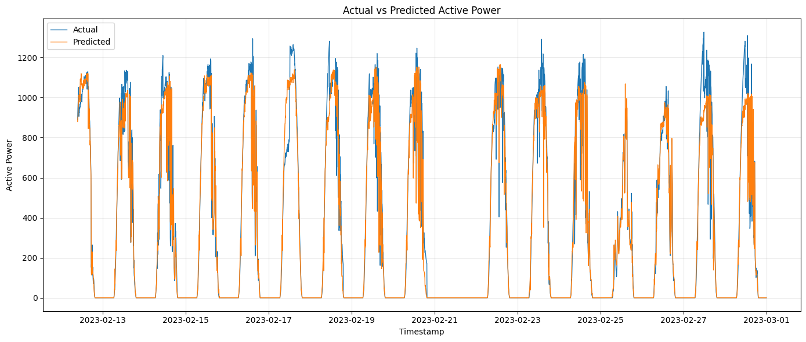
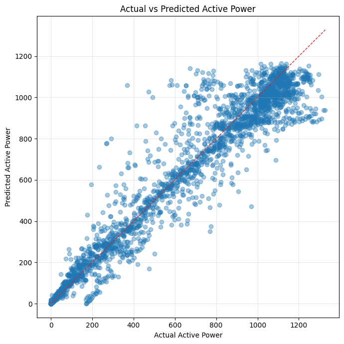
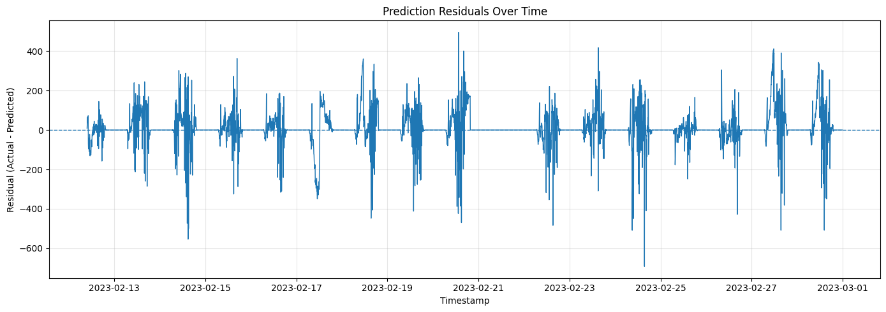
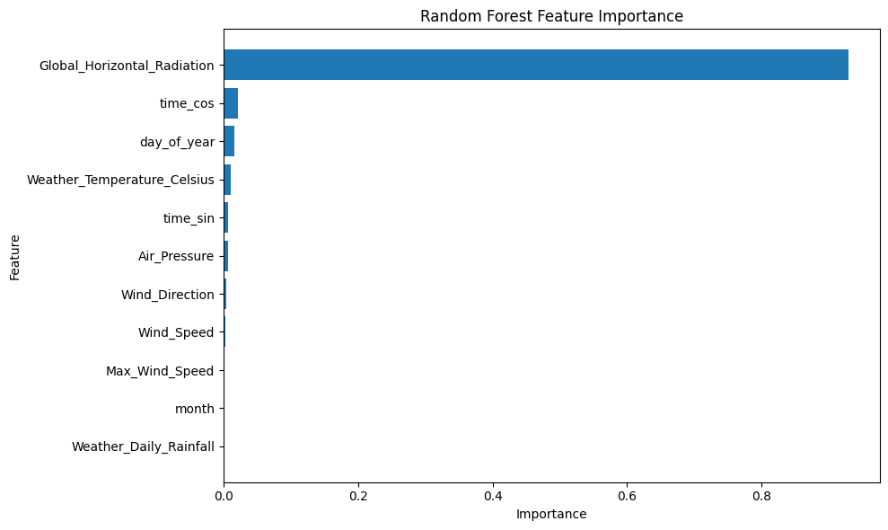

# Photovoltaic Power Prediction Using Random Forest

## Informasi Proyek

| Keterangan | Detail |
|---|---|
| Anggota 1 | [Radeva Chanika] — [23030224018] |
| Anggota 2 | [Amelia Rahmawati] — [23030224013] |
| Anggota 3 | [Syifa Muthia Salsabila] — [23030224021] |
| Anggota 4 | [Nadya Shafa Aulia Eka Putri Arsad] — [23030224073] |
| Anggota 5 | [Galuh Kurnia Pratama] — [23030224105] |
| Mata Kuliah | Instrumentasi Cerdas |
| Dosen Pembimbing | Dr. Muhimmatul Khoiro, S.Si. |
| Topik | Prediksi Active Power Photovoltaic |
| Metode | Random Forest Regression |

---

## Project Overview

Proyek ini membahas pengolahan data photovoltaic dan pengembangan model machine learning untuk memprediksi `Active_Power` berdasarkan data cuaca dan fitur waktu.

Dataset awal terdiri dari dataset musiman:

- Spring 2022–2023

Tahapan proyek meliputi EDA, preprocessing, pemodelan Random Forest Regression, dan evaluasi model.

---

## Project Objective

Proyek ini bertujuan untuk:

1. Memahami karakteristik dataset photovoltaic.
2. Mengevaluasi kualitas data.
3. Melakukan preprocessing data.
4. Menganalisis hubungan variabel cuaca dengan `Active_Power`.
5. Membangun model Random Forest Regression.
6. Mengevaluasi performa model.
7. Menganalisis feature importance.
8. Melakukan optimasi hyperparameter.
9. Menentukan model yang sesuai berdasarkan hasil evaluasi.

---

## Dataset

Dataset yang digunakan berisi pengukuran photovoltaic dan parameter meteorologi.

Variabel yang digunakan dalam model meliputi:

```text
Wind_Speed
Weather_Temperature_Celsius
Global_Horizontal_Radiation
Wind_Direction
Weather_Daily_Rainfall
Max_Wind_Speed
Air_Pressure
time_sin
time_cos
day_of_year
month
````

Target:

```text
Active_Power
```

Dataset hasil preprocessing disimpan pada:

```text
data/processed/
```

Data mentah tetap disimpan secara terpisah pada:

```text
assets/data/
```

Data raw tidak dimodifikasi secara langsung.

---

## Project Structure

```text
project/
│
├── data/
│   ├── raw/
│   └── processed/
│
├── notebooks/
│   ├── 01_eda.ipynb
│   ├── 02_eda_comparison.ipynb
│   ├── 03_data_preprocessing.ipynb
│   └── 04_random_forest.ipynb
│
├── results/
│   ├── figures/
│   └── tables/
│
├── models/
│
└── README.md
```

---

## Workflow

```text
Raw Data
   ↓
EDA
   ↓
Dataset Comparison
   ↓
Data Preprocessing
   ↓
Feature & Target Selection
   ↓
Chronological Train-Test Split
   ↓
Random Forest Baseline
   ↓
Feature Importance Analysis
   ↓
Feature Reduction Experiment
   ↓
Hyperparameter Tuning
   ↓
Final Model Evaluation
   ↓
Model Validation
   ↓
Final Random Forest Model
```

---

## Random Forest Regression

Model yang digunakan adalah `RandomForestRegressor` dari scikit-learn.

Target model:

```text
Active_Power
```

Karena `Active_Power` merupakan nilai numerik kontinu, permasalahan ini dikategorikan sebagai **regression**, bukan classification.

Data dibagi menggunakan chronological train-test split untuk mempertahankan urutan waktu:

```text
80% Training
20% Testing
```

Data tidak diacak secara random untuk menghindari potensi temporal leakage.

---

## Baseline Model

Baseline Random Forest menggunakan:

```text
n_estimators = 200
random_state = 42
```

Hasil baseline pada test set:

| Metric |  Result |
| ------ | ------: |
| MAE    | 41.2227 |
| RMSE   | 84.2465 |
| R²     |  0.9628 |

Model mampu menangkap pola utama `Active_Power`, tetapi error cenderung meningkat pada nilai daya yang lebih tinggi.

---

## Feature Analysis

Feature importance menunjukkan bahwa:

```text
Global_Horizontal_Radiation
```

merupakan fitur paling dominan dalam model.

Feature importance berbasis Random Forest menunjukkan kontribusi sekitar 92,93%.

Permutation importance juga menunjukkan bahwa `Global_Horizontal_Radiation` memberikan kontribusi terbesar terhadap performa model.

Analisis feature reduction menunjukkan bahwa penggunaan seluruh 11 fitur memberikan performa yang lebih baik dibandingkan penggunaan hanya 4 atau 2 fitur teratas.

---

## Hyperparameter Tuning

Hyperparameter tuning dilakukan menggunakan `RandomizedSearchCV` dengan `TimeSeriesSplit`.

Parameter terbaik yang diperoleh:

```text
n_estimators      = 500
max_depth         = 10
min_samples_split = 5
min_samples_leaf  = 2
max_features      = log2
```

Hasil tuned model pada test set:

| Metric |  Result |
| ------ | ------: |
| MAE    | 43.0992 |
| RMSE   | 80.8455 |
| R²     |  0.9657 |

Dibandingkan baseline, tuned model menghasilkan RMSE dan R² yang lebih baik, sementara MAE sedikit meningkat.

---

## Model Evaluation

Evaluasi model menggunakan:

* MAE
* MSE
* RMSE
* R²
* Actual vs Predicted
* Scatter Actual vs Predicted
* Prediction Residuals
* Feature Importance

Evaluasi dilakukan pada data testing yang dipisahkan berdasarkan urutan waktu.

---

## Results

### Model Performance

| Model | MAE | RMSE | R² |
|---|---:|---:|---:|
| Random Forest Baseline | 41.2227 | 84.2465 | 0.9628 |
| Random Forest Tuned | 43.0992 | 80.8455 | 0.9657 |

### Actual vs Predicted

<p align="center">
  
</p>

### Scatter Actual vs Predicted

<p align="center">
  
</p>

### Prediction Residuals

<p align="center">
  
</p>

### Feature Importance

<p align="center">
  
</p>

---

## Final Model

Model final yang digunakan adalah **Tuned Random Forest Regression** dengan konfigurasi:

```text
n_estimators      = 500
max_depth         = 10
min_samples_split = 5
min_samples_leaf  = 2
max_features      = log2
random_state      = 42
```

## Model final disimpan pada:

models/random_forest_final.pkl

### Performa final pada test set:

Metric	Result
MAE	43.0992
RMSE	80.8455
R²

---

## Technology

* Python
* Jupyter Notebook
* VS Code
* pandas
* NumPy
* Matplotlib
* Seaborn
* scikit-learn

---

## Reproducibility

Proyek menggunakan:

* relative file paths
* fixed random state
* documented preprocessing
* documented model parameters
* chronological data splitting

Raw dataset tidak ditimpa oleh hasil preprocessing.

---

## Important Notes

1. `Active_Power` digunakan sebagai target regression.
2. Data photovoltaic diperlakukan sebagai time-series data.
3. Train-test split mempertahankan urutan waktu.
4. Test set tidak digunakan untuk menentukan hyperparameter.
5. Feature importance tidak diinterpretasikan sebagai hubungan kausal.
6. Preprocessing dan pemilihan fitur harus dapat dijelaskan berdasarkan karakteristik data.
7. Hasil model merepresentasikan performa pada periode testing yang digunakan dalam eksperimen.

---
## License

This project is licensed under the MIT License.

See the [LICENSE](LICENSE) file for details.